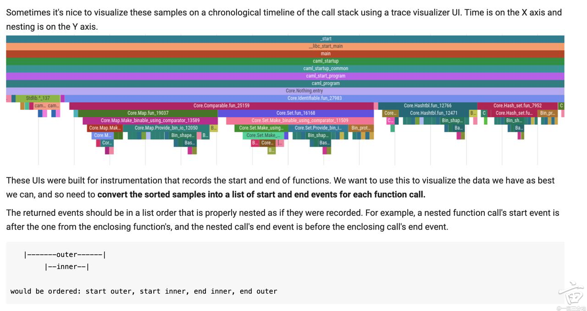

# Profiler Trace from Stack Samples (Coding Q3)

**Sources:**
- [1point3acres (1121522)](https://www.1point3acres.com/bbs/thread-1121522-1-1.html)
- [1point3acres (1143498)](https://www.1point3acres.com/bbs/thread-1143498-1-1.html)
- [1point3acres (1089271)](https://www.1point3acres.com/bbs/thread-1089271-1-1.html)
- [1point3acres (1137986)](https://www.1point3acres.com/bbs/thread-1137986-1-1.html)
- [1point3acres (1135727)](https://www.1point3acres.com/bbs/thread-1135727-1-1.html)
- [1point3acres (1135132)](https://www.1point3acres.com/bbs/thread-1135132-1-1.html)

### Problem Description
You are building a visualization tool for a sampling profiler.
The input is a series of stack samples taken at periodic timestamps.
Each `Sample` contains a timestamp and a list of function names representing the call stack at that moment (ordered from root to leaf).

**Goal:** Convert these samples into a list of `Event` objects (start/end) suitable for a timeline visualization.

**Visual Representation:**
The output should resemble a "Flame Graph" where the X-axis is time and the Y-axis is stack depth.


> "The returned events should be in a list order that is properly nested as if they were recorded. For example, a nested function call's start event is after the one from the enclosing function's, and the nested call's end event is before the enclosing call's end event."
> `|-------outer-------|`
> `   |--inner--|`
> result: `start outer, start inner, end inner, end outer`

### Key Definition: "Consecutive"
A function is only considered the *same* execution if it appears in consecutive samples **at the same stack depth and with the same parentage**.
- **Example 1 (Continuous):**
  ```
  T1: [main, A]
  T2: [main, A, B]
  ```
  `main` at T1 and T2 are the same. `A` at T1 and T2 are the same. `B` starts at T2.

- **Example 2 (Discontinuous - Distinguishing Recursion Instances):**
  ```
  T1: [a, b, a, c]
  T2: [a, a, b, c]
  ```
  - `a` (index 0) continues. LCP = 1.
  - `b` (T1, index 1) != `a` (T2, index 1). Mismatch.
  - **End:** `c` (inner), `a` (inner), `b` (from T1, leaf to root order).
  - **Start:** `a` (inner), `b` (new), `c` (new) (from T2, root to leaf order).
  - *Result:* `End(c)`, `End(a)`, `End(b)`, `Start(a)`, `Start(b)`, `Start(c)`.

### Solution Logic (The "Diff" Approach)

The core idea is to process samples sequentially and compare the current stack (`curr`) with the previous stack (`prev`).

1.  **Find Longest Common Prefix (LCP):**
    - Determine how many frames from the root are identical in both `prev` and `curr`.
    - These frames are continuing execution.
    - **CRITICAL:** The moment `prev[i] != curr[i]`, **ALL** subsequent frames in `prev` (indices > i) must END, and **ALL** subsequent frames in `curr` (indices > i) must START.

2.  **Handle Ends (Pop):**
    - Any frames in `prev` that are *beyond* the LCP have finished.
    - We must emit `End` events for them.
    - **Order:** Emit in reverse order (leaf first) to respect nesting.
    - Timestamp: Use the current sample's timestamp.

3.  **Handle Starts (Push):**
    - Any frames in `curr` that are *beyond* the LCP are new.
    - We must emit `Start` events for them.
    - Order: From LCP to leaf.

### Follow-up: Coding & Design Session
Candidates report a separate "Coding and Design" session involving **LLM-related design principles** and **Python code** in Google Colab.
- **Speculation:** This might be the **Stock Agent (Tool Use)** question or a variation of **Prompt Playground**.
- **Key Signal:** "Writing code with LLMs as a building block" matches the Stock Agent problem perfectly.
- **Advice:** Prepare for Tool Use / Agent Implementation (Coding Q2/Agent) as well as the Profiler logic.
